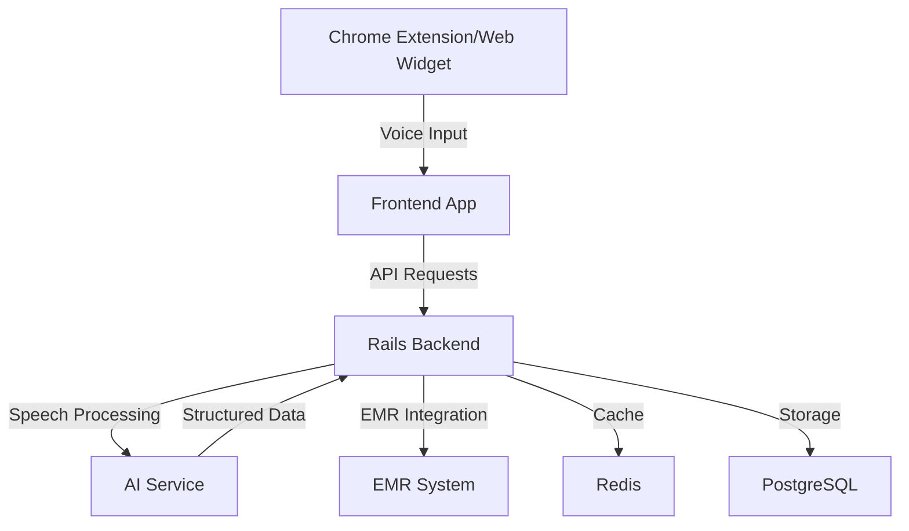
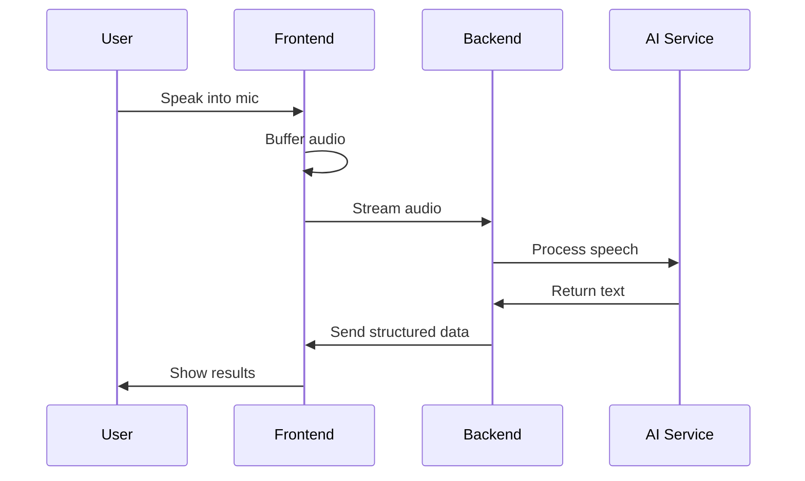
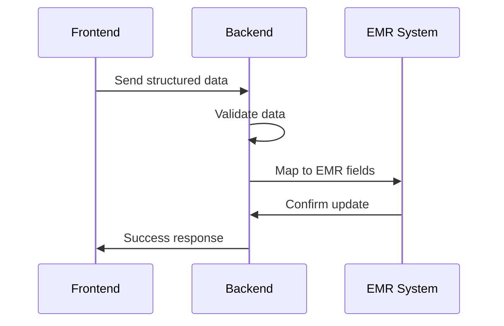

# Architecture Overview

This document provides a comprehensive overview of Medispeak's architecture, explaining how different components work together to provide seamless voice-to-EMR functionality.

## System Architecture



## Component Overview

### 1. Frontend Components

#### Chrome Extension
- **Technology**: React + TypeScript
- **Key Features**:
  - Voice capture and processing
  - EMR field detection
  - Real-time feedback
  - Offline capability
- **Integration Points**:
  - Chrome Extension API
  - WebRTC for audio
  - Backend API communication

#### Web Widget
- **Technology**: React + TypeScript
- **Features**:
  - Embeddable interface
  - Customizable UI
  - Event-driven architecture
- **Integration**:
  - Custom events system
  - iframe communication
  - PostMessage API

### 2. Backend Services

#### Rails API Server
- **Technology**: Ruby on Rails
- **Responsibilities**:
  - Request handling
  - Authentication
  - Business logic
  - Data persistence
- **Key Features**:
  - RESTful API
  - WebSocket support
  - Background job processing
  - Caching layer

#### AI Processing Service
- **Components**:
  - Speech-to-text engine
  - Medical terminology processor
  - Context analyzer
  - Field mapper
- **Technologies**:
  - TensorFlow/PyTorch models
  - NLP processing pipeline
  - Custom medical models

### 3. Data Storage

#### PostgreSQL Database
- **Schema Overview**:
  ```sql
  -- Core tables
  users
  organizations
  transcriptions
  emr_mappings
  
  -- Reference tables
  medical_terms
  field_templates
  specialties
  ```
- **Key Features**:
  - HIPAA compliance
  - Audit logging
  - Data encryption
  - Performance optimization

#### Redis Cache
- **Usage**:
  - Session management
  - Rate limiting
  - Real-time data
  - Job queues
- **Key Features**:
  - High availability
  - Data persistence
  - Pub/sub capabilities

## Data Flow

### 1. Voice Input Processing


### 2. EMR Integration


## Security Architecture

### 1. Authentication
- JWT-based authentication
- OAuth2 integration
- Multi-factor authentication
- Session management

### 2. Data Protection
- End-to-end encryption
- At-rest encryption
- HIPAA compliance
- Audit logging

### 3. Network Security
- TLS/SSL encryption
- API rate limiting
- CORS policies
- WAF integration

## Scalability

### 1. Horizontal Scaling
- Load balancing
- Service replication
- Database sharding
- Cache distribution

### 2. Performance Optimization
- CDN integration
- Query optimization
- Caching strategies
- Background processing

## Monitoring and Logging

### 1. System Monitoring
- Performance metrics
- Error tracking
- Usage statistics
- Health checks

### 2. Logging
- Structured logging
- Log aggregation
- Audit trails
- Analytics

## Development Workflow

### 1. Code Organization
```
frontend/
├── src/
│   ├── components/
│   ├── services/
│   ├── hooks/
│   └── utils/
backend/
├── app/
│   ├── controllers/
│   ├── models/
│   └── services/
└── lib/
    └── ai/
```

### 2. Deployment Pipeline
- Continuous Integration
- Automated testing
- Staging environments
- Production deployment

## Future Architecture Considerations

### 1. Scalability Improvements
- Microservices architecture
- Serverless components
- Edge computing
- Global distribution

### 2. AI Enhancements
- Custom model training
- Real-time learning
- Specialty-specific models
- Multi-language support

## Contributing

For information on contributing to Medispeak's architecture:
1. Review our [Contributing Guidelines](/docs/contribute)
2. Check [Future Projects](/docs/projects)
3. Join architecture discussions on GitHub 